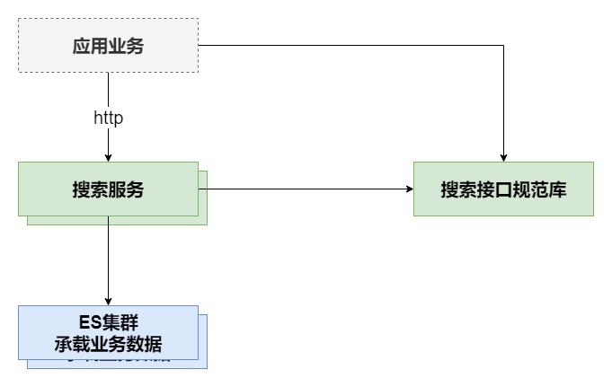

# 搜索服务

## 需求描述

## 业务设计
抽象多数站内数据搜索共性需求：访问控制、元数据管理和文档管理

### 访问控制
待实现
### 元数据管理
- Index创建和删除（基于ES7.x规范，不包含Type元）
- Mapping在Index创建后自动创建
- Index的创建和Mapping的创建为一个事务
### 文档管理
- 设计文档结构为一下形式：
  ```java
  public class DocumentEntity implements Serializable {
    @Id
    private String id;
  
    @Field(type = FieldType.Text, analyzer = "ik_max_word", searchAnalyzer = "ik_max_word")
    private String title;
  
    @Field(type = FieldType.Keyword)
    private String source;
  
    @Field(type = FieldType.Text, analyzer = "ik_max_word", searchAnalyzer = "ik_max_word")
    private Set<String> tags;
  
    @Field(type = FieldType.Text, analyzer = "ik_max_word", searchAnalyzer = "ik_max_word")
    private List<String> contents;
  
    @Field(type = FieldType.Keyword)
    private String link;
  
    @Field(type = FieldType.Date,format = DateFormat.basic_date_time)
    private String time;    
  }
  ```
- 参与全文检索字段为title,tags,contents
- 检索默认高亮标记为<strong></strong>，且可以自定义
- 检索结果中包含：命中数量，ID，来源，标题，标签，内容，时间，链接
- 检索输入和输出可见接口描述
- demo
## 架构设计


## 集成设计

- 客户端使用maven接入搜索接口规范库

## 接入说明


## 服务配置
```text
# ES服务集群地址
spring.elasticsearch.rest.uris=node-1:9200,node-2:9200
# 检索最大字符长度
search.query.key.word.max.length=120
# 高亮片段最大数量
search.result.highlight.fragment.number=12
# 高亮片段最大长度
search.result.highlight.fragment.length=120
# 命中标题中最大字符长度
search.result.title.max.length=120
# 命中标签最大数量
search.result.tag.max.length=20
# 命中内容最大字符长度
search.result.content.max.length=120
```

